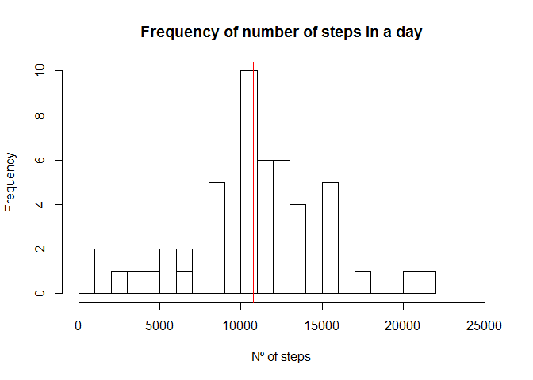
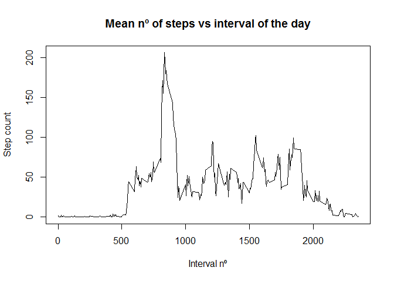
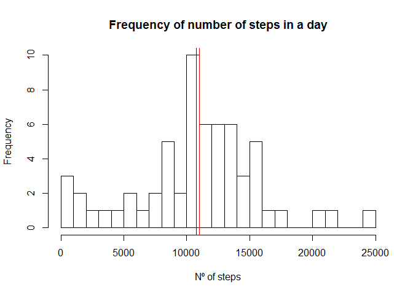
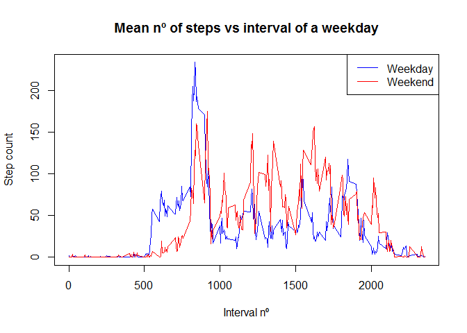

# Reproducible Research: Peer Assessment 1


## Loading and preprocessing the data


```r
library(ggplot2)
Sys.setlocale(category = "LC_ALL", locale = "english")
```

```
## [1] "LC_COLLATE=English_United States.1252;LC_CTYPE=English_United States.1252;LC_MONETARY=English_United States.1252;LC_NUMERIC=C;LC_TIME=English_United States.1252"
```

```r
rawData <- read.csv(unz("activity.zip", "activity.csv"))
noNA <- subset(rawData, !is.na(steps))
```

## What is mean total number of steps taken per day?


```r
stepsPerDay <- aggregate(noNA$steps, by=list(noNA$date), FUN=sum)
names(stepsPerDay) <- c("date", "steps")

hist(stepsPerDay$steps, main = "Frequency of number of steps in a day", xlab = "Nº of steps",breaks = 25, xlim = c(0, 25000))

abline(v=mean(stepsPerDay$steps), col="blue")
abline(v=median(stepsPerDay$steps), col="red")
```

<!-- -->

Mean of total number of steps a day

```r
mean(stepsPerDay$steps)
```

```
## [1] 10766.19
```

Median of total number of steps a day

```r
median(stepsPerDay$steps)
```

```
## [1] 10765
```

## What is the average daily activity pattern?


```r
stepsPerInterval <- aggregate(noNA$steps, by=list(noNA$interval), FUN=mean)
names(stepsPerInterval) <- c("interval", "steps")
plot(stepsPerInterval$interval, stepsPerInterval$steps, type="l", main="Mean nº of steps vs interval of the day", xlab="Interval nº", ylab="Step count")
```

<!-- -->

Interval with highest average number of steps:


```r
stepsPerInterval[stepsPerInterval$steps == max(stepsPerInterval$steps),]$interval
```

```
## [1] 835
```

## Imputing missing values

Total number of missing values:


```r
length(rawData[is.na(rawData$steps),]$steps)
```

```
## [1] 2304
```

Fill missing values with the average number of steps for the given interval


```r
onlyNAs <- rawData[is.na(rawData$steps),]
#rawData[is.na(rawData$steps),]$steps

rawData[is.na(rawData$steps),]$steps <- merge(onlyNAs, stepsPerInterval, by="interval")$steps.y
```

Histogram for new dataset


```r
stepsPerDay <- aggregate(rawData$steps, by=list(rawData$date), FUN=sum)
names(stepsPerDay) <- c("date", "steps")

hist(stepsPerDay$steps, main = "Frequency of number of steps in a day", xlab = "Nº of steps",breaks = 25, xlim = c(0, 25000))

abline(v=mean(stepsPerDay$steps), col="blue")
abline(v=median(stepsPerDay$steps), col="red")
```

<!-- -->

Mean of total number of steps a day after filling NAs

```r
mean(stepsPerDay$steps)
```

```
## [1] 10766.19
```

Median of total number of steps a day after filling NAs

```r
median(stepsPerDay$steps)
```

```
## [1] 11015
```

## Are there differences in activity patterns between weekdays and weekends?


```r
weekdayData <- noNA[!(weekdays(as.Date(as.character(noNA$date))) %in% c("Sunday", "Saturday")),]
weekendData <- noNA[weekdays(as.Date(as.character(noNA$date))) %in% c("Sunday", "Saturday"),]

weekdayStepsPerInterval <- aggregate(weekdayData$steps, by=list(weekdayData$interval), FUN=mean)
names(weekdayStepsPerInterval) <- c("interval", "steps")
plot(weekdayStepsPerInterval$interval, weekdayStepsPerInterval$steps, type="l", main="Mean nº of steps vs interval of a weekday", xlab="Interval nº", ylab="Step count", col="blue")

weekendStepsPerInterval <- aggregate(weekendData$steps, by=list(weekendData$interval), FUN=mean)
names(weekendStepsPerInterval) <- c("interval", "steps")
lines(weekendStepsPerInterval$interval, weekendStepsPerInterval$steps, col="red")

legend("topright", legend = c("Weekday", "Weekend"), col=c("blue", "red"), lwd = 1)
```

<!-- -->
